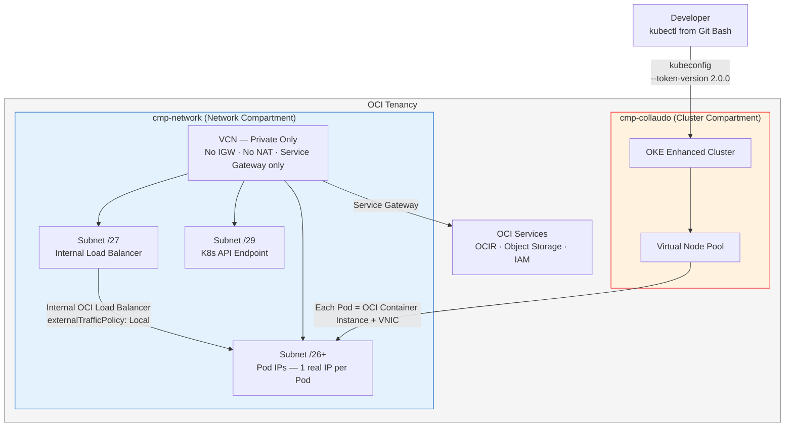
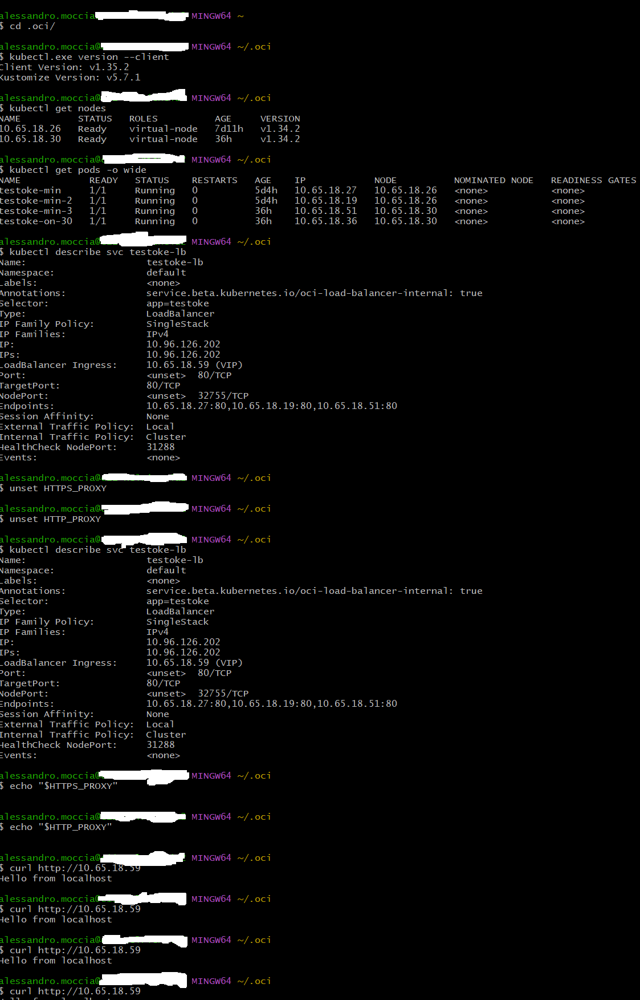
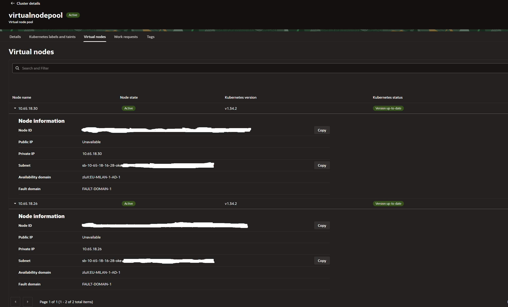

# OKE Virtual Node Pool – Technical Deep Dive

[](https://www.oracle.com/cloud/)
[](https://docs.oracle.com/en-us/iaas/Content/ContEng/home.htm)
[](https://ace.oracle.com)

> Enterprise-grade OKE Virtual Node Pool in a fully private cross-compartment OCI architecture.  
> Original technical work prepared for the **Oracle ACE Program**.

---

## Architecture



---

## Key Findings

| # | Finding | Why It Matters |
|---|---------|----------------|
| 1 | `CLUSTER_VIRTUAL_NODE_POOL_CREATE` requires `cluster-family` in **both** cluster AND network compartment | Fails silently — not in official docs — confirmed via Oracle Support SR |
| 2 | Cluster/virtualnode IAM principal **cannot** pull from OCIR | docker-registry Secret on ServiceAccount is the only supported mechanism |
| 3 | `requests == limits` (Guaranteed QoS) is a **structural requirement** on Virtual Nodes | Ambiguous resource footprint causes non-deterministic Pending |
| 4 | VNIC GC window creates IP unavailability after Pod deletion | Predictable Pending on rapid scale/delete cycles with small subnets |
| 5 | LB resets are 3-layer async reconciliation artifacts | Eliminated by readinessProbe aligned with LB health check timing |
| 6 | DaemonSet log collection is **incompatible** with Virtual Nodes | Requires external API-based collector → OCI Object Storage via Service Gateway |

---

## Topics Covered

- **Cross-Compartment IAM** — multi-scope evaluation behavior confirmed via Oracle Support SR
- **Authentication Bootstrap** — mandatory Secret-first model before Workload Identity
- **Workload Identity** — Dynamic Group, IAM policies, ServiceAccount annotation
- **Deterministic Provisioning** — Guaranteed QoS structural requirement on Virtual Nodes
- **Pod Pending Analysis** — resource imprint and CIDR exhaustion root causes
- **Load Balancer Hardening** — async reconciliation and readinessProbe alignment
- **Application Logging** — API-based external collector for serverless Virtual Node environments
- **Production Baseline** — validated golden configuration with complete manifests

---

## Repository Structure

```
oke-virtual-nodepool-deep-dive/
│
├── docs/
│   └── OKE_VirtualNodePool_ACE_TechnicalDeepDive.docx   ← Full technical whitepaper
│
├── manifests/
│   ├── 00-serviceaccount.yaml    ← Dedicated SA with OCIR pull secret
│   ├── 10-deployment.yaml        ← Production baseline deployment (Guaranteed QoS)
│   └── 20-service-lb.yaml        ← Internal OCI Load Balancer service
│
├── iam-policies/
│   └── policies-baseline.md      ← Cross-compartment IAM full baseline
│
├── screenshots/
│   ├── 01-kubectl-nodes-pods-lb.png       ← kubectl: nodes, pods, LB from Git Bash
│   ├── 02-console-virtual-nodepool.png    ← OCI Console: Virtual Node Pool ACTIVE
│   └── 03-console-container-instances.png ← OCI Console: Container Instances per Pod
│
└── README.md
```

---

## Runtime Evidence

### kubectl — Virtual Nodes, Pods Running, Internal LB


### OCI Console — Virtual Node Pool ACTIVE


### OCI Console — Container Instances (one per Pod)


---

## IAM Baseline (Cross-Compartment)

```
# ── USER GROUP ──────────────────────────────────────────────────────────────

# Cluster compartment
Allow group <domain>/<group> to manage cluster-family
  in compartment <cluster-compartment>

# Network compartment — CRITICAL: undocumented requirement confirmed via SR
Allow group <domain>/<group> to manage cluster-family
  in compartment <network-compartment>

# ── CLUSTER PRINCIPAL (OCI CNI runtime) ─────────────────────────────────────

Allow any-user to manage instances in compartment <cluster-compartment>
  where all { request.principal.type = 'cluster',
               request.principal.id  = '<cluster-ocid>' }

Allow any-user to use private-ips in compartment <network-compartment>
  where all { request.principal.type = 'cluster',
               request.principal.id  = '<cluster-ocid>' }

Allow any-user to use network-security-groups in compartment <network-compartment>
  where all { request.principal.type = 'cluster',
               request.principal.id  = '<cluster-ocid>' }

# ── ENDORSE (Virtual Node → Container Instance association) ──────────────────

define tenancy ske as <oke-tenancy-ocid>
define compartment ske_compartment as <oke-compartment-ocid>

endorse any-user to associate compute-container-instances
  in compartment ske_compartment of tenancy ske
  with subnets in tenancy
  where ALL { request.principal.type = 'virtualnode',
              request.operation      = 'CreateContainerInstance' }

endorse any-user to associate compute-container-instances
  in compartment ske_compartment of tenancy ske
  with vnics in tenancy
  where ALL { request.principal.type = 'virtualnode',
              request.operation      = 'CreateContainerInstance' }
```

> The `cluster-family` grant in the **network compartment** is not documented in Oracle official docs.  
> Confirmed via Oracle Support SR — backend logs showed `authorizedPermissions: []` for `CLUSTER_VIRTUAL_NODE_POOL_CREATE` without it.

---

## Quick Start

```bash
# 1. Create namespace
kubectl create namespace poc-oke

# 2. Create OCIR pull secret — mandatory bootstrap step
kubectl -n poc-oke create secret docker-registry ocir-pullsecret \
  --docker-server=<region>.ocir.io \
  --docker-username='<tenancy-namespace>/<identity-domain>/<username>' \
  --docker-password='<auth-token>'

# 3. Apply manifests
kubectl apply -f manifests/00-serviceaccount.yaml
kubectl apply -f manifests/10-deployment.yaml
kubectl apply -f manifests/20-service-lb.yaml

# 4. Verify
kubectl -n poc-oke get pods -o wide
kubectl -n poc-oke get svc
kubectl -n poc-oke rollout status deployment/testoke
```

---

## Production Checklist

- [ ] `cluster-family` in **both** cluster and network compartment
- [ ] `any-user` policies for cluster principal (OCI CNI)
- [ ] `endorse` policies for virtualnode → Container Instance
- [ ] docker-registry Secret on dedicated ServiceAccount (bootstrap)
- [ ] Workload Identity configured (operational phase)
- [ ] `requests == limits` on all containers (Guaranteed QoS)
- [ ] Pod subnet minimum `/26` for production
- [ ] `readinessProbe` aligned with LB health check timing
- [ ] `externalTrafficPolicy: Local` on LoadBalancer Service
- [ ] `preStop` sleep for graceful connection drain
- [ ] External API-based log collector (DaemonSet not supported)

---

## Full Technical Whitepaper

 [OKE_VirtualNodePool_ACE_TechnicalDeepDive.docx](docs/OKE_VirtualNodePool_ACE_TechnicalDeepDive.docx)
 📄 [OKE_VirtualNodePool_ACE_TechnicalDeepDive.pdf](docs/OKE_VirtualNodePool_ACE_TechnicalDeepDive.pdf)

---

## References

- [OKE Virtual Nodes — Required IAM Policies](https://docs.oracle.com/en-us/iaas/Content/ContEng/Tasks/contengvirtualnodes-Required_IAM_Policies.htm)
- [OCI CNI Plugin — Cross-Compartment IAM](https://docs.oracle.com/en-us/iaas/Content/ContEng/Concepts/contengpodnetworking_topic-OCI_CNI_plugin.htm)
- [OKE Workload Identity](https://docs.oracle.com/en-us/iaas/Content/ContEng/Tasks/contenggrantingworkloadaccesstoresources.htm)
- [Kubernetes Pod QoS Classes](https://kubernetes.io/docs/concepts/workloads/pods/pod-qos/)

---

## Author

**Alessandro Moccia**  
Oracle Solution Architect | OCI Specialist  
*Oracle ACE Program Candidate*

---

*All findings are empirically validated and supported by Oracle Support Service Request evidence.*
